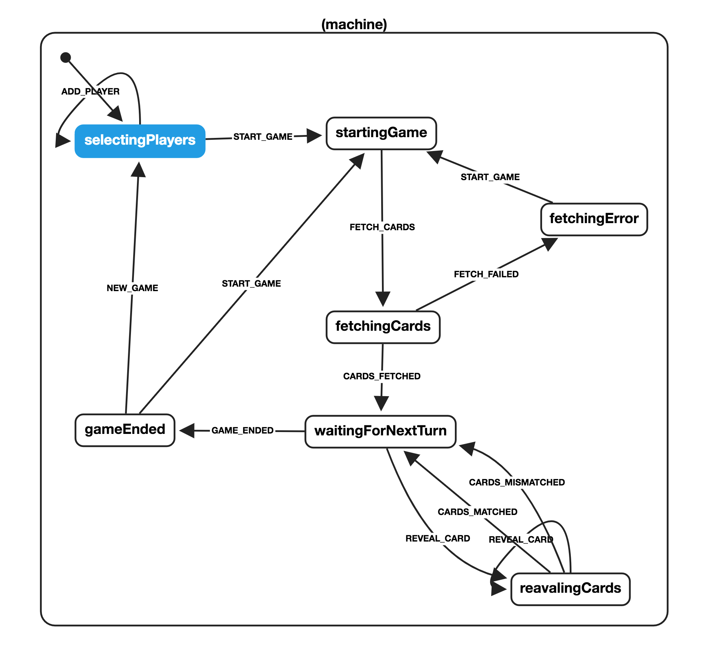

# Memory Game with Finite State Machine

## Demo
https://vincentschroeder.github.io/memory-game/

## Installation Quickstart

```sh
git clone https://github.com/vincentschroeder/memory-game.git
cd memory-game
npm install
npm start
```

## The Rules

- all cards are face-down at the beginning
- each turn consists of revealing to cards on the table
- finding a pair matching cards gives one point and an extra turn
- not finding a pair results in the next player's turn
- when there are no more cards the player with the highest score wins

## The task

- get a bunch of photos from API endpoint
- display the game cards with the photos (facing "down") at random positions
- implement the game with the rules as described above
- keep track of the score

## Bonus

- multi-player support
- animations
- nice layout

## My Solution

I used [Create React App](https://github.com/facebook/create-react-app) to bootstrap the project. For better understanding I created this state visualisation, which you can find as well in the code as a Json definition in the "App" React Component.




### `npm run build`

Builds the app for production to the `build` folder.
It correctly bundles React in production mode and optimizes the build for the best performance.

The build is minified and the filenames include the hashes.<br>
